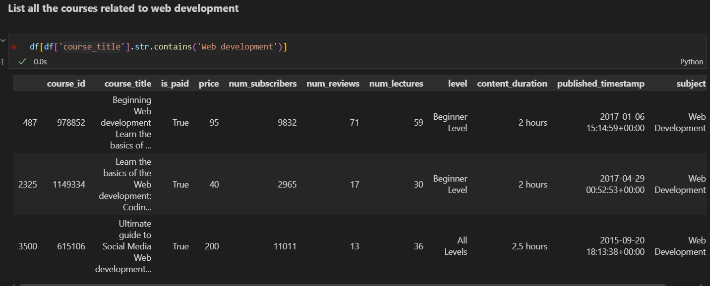

## UDEMY COURSES DATA ANALYSIS 

- **This repo include udemy courses data analysis using pandas and matplotlib including cleaning data, take insights from data**

- **Below are the some take aways of data analysis of udemy courses**

## 💡 Key Learnings:

- **Data preprocessing with pandas**

- **Converting text-based durations to numeric values**

- **Using groupby() and aggregation for statistical insights**

- **Creating meaningful visualizations with matplotlib**