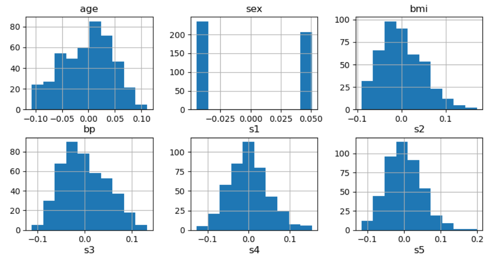
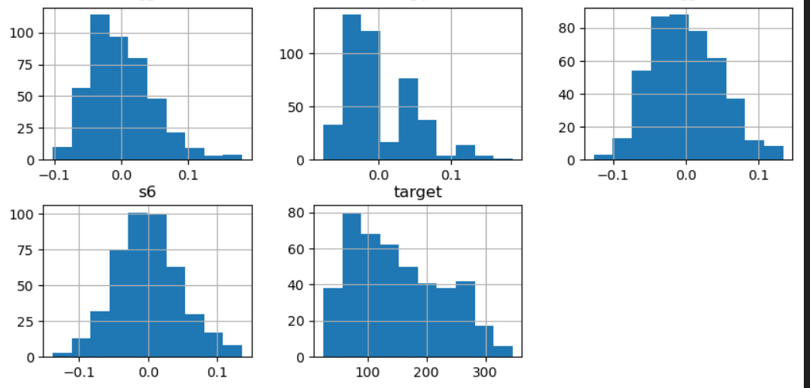
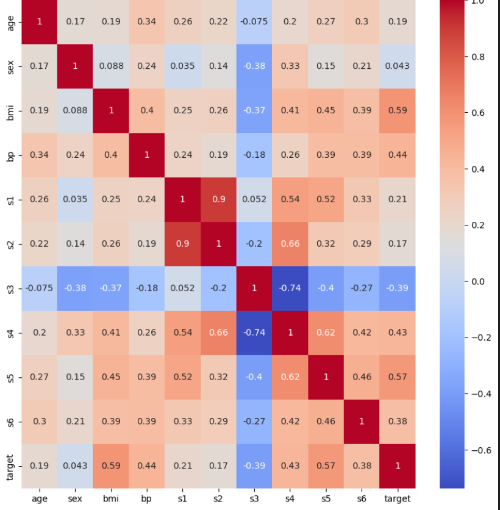
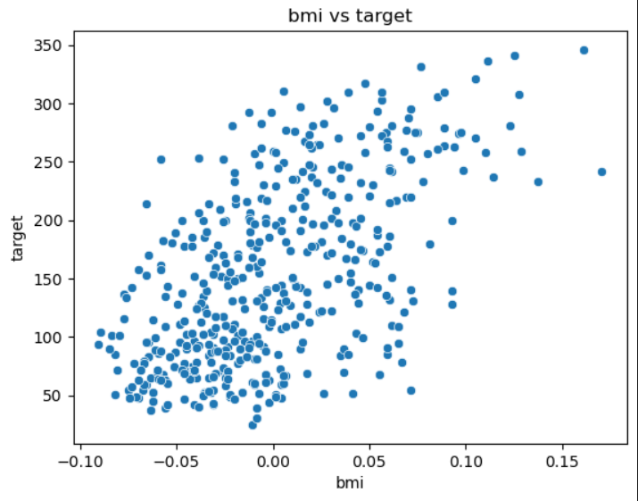
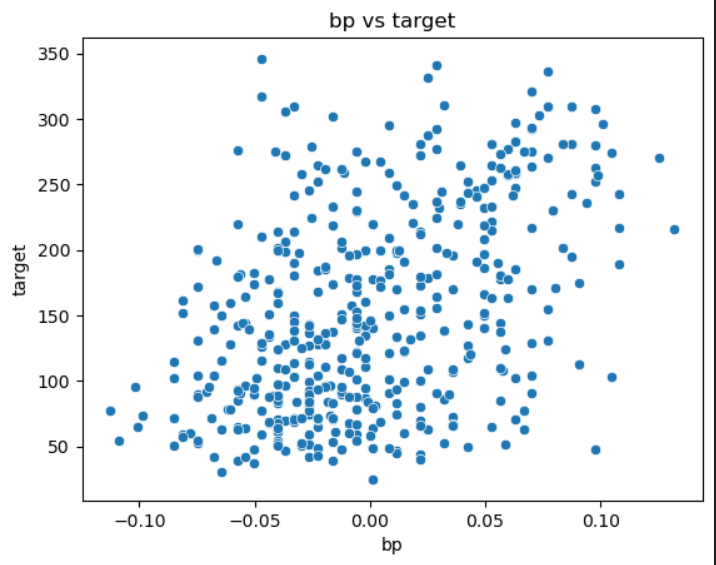
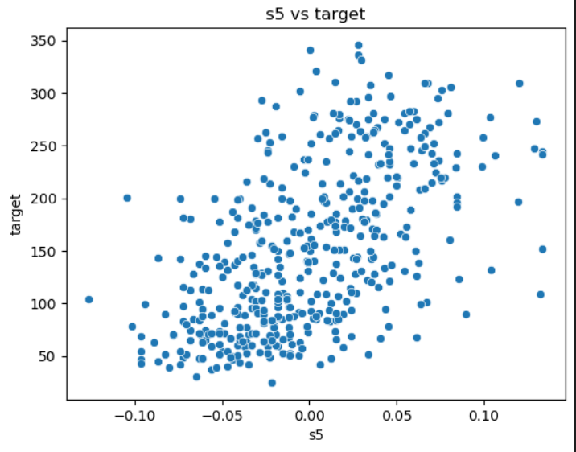
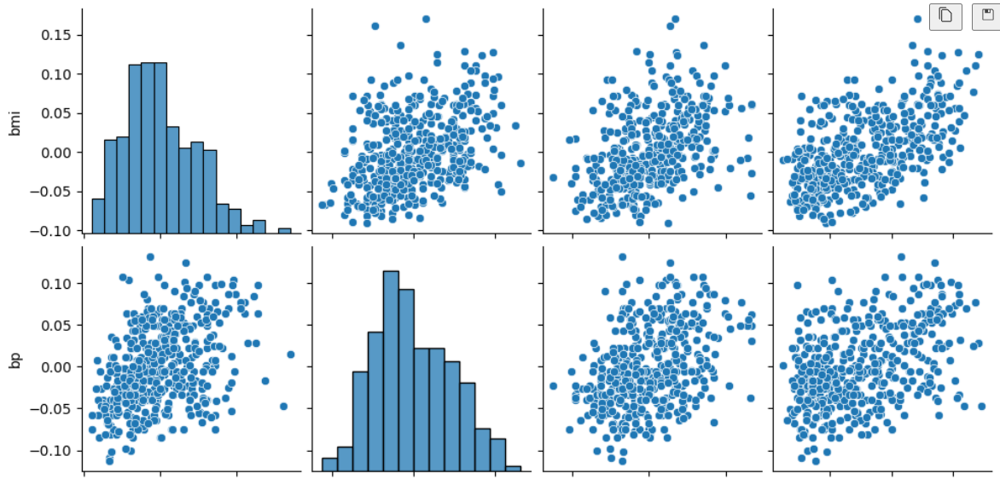
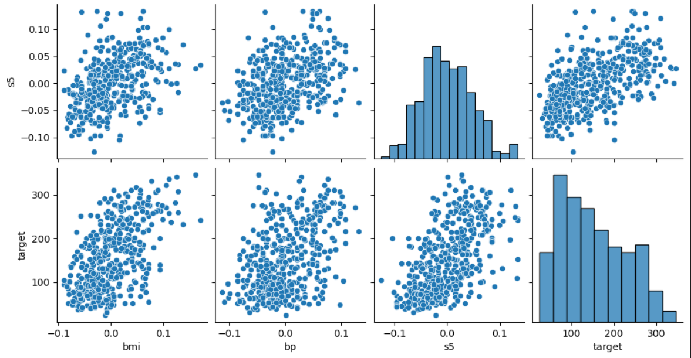
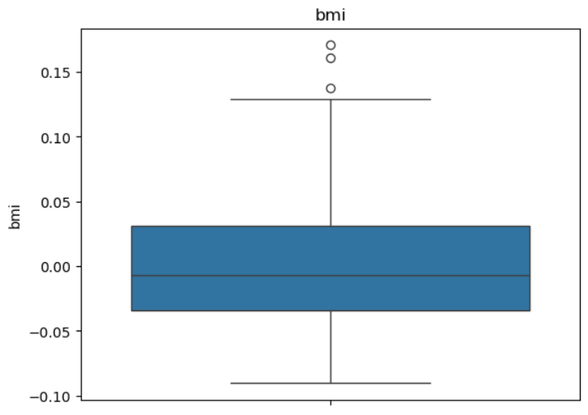
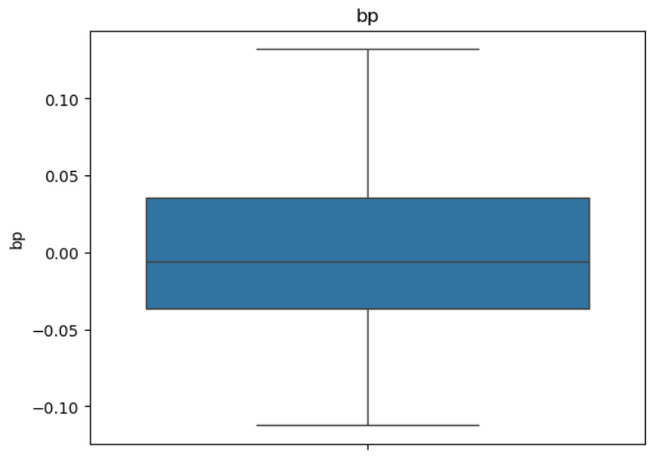

## **Project Title**

- ### **Diabetes Dataset Analysis and Linear Regression Model**

## **Project Overview**

- **This project focuses on performing Exploratory Data Analysis (EDA) and building a Linear Regression model using the Diabetes dataset from 'sklearn.datasets'. The goal is to understand the relationships between medical attributes and diabetes progression**

## **Dataset Description**

- **The dataset is loaded from 'sklearn.datasets.load_diabetes'.**
    - It contains:
        - 10 numerical independent variables (features)
        - 1 target variable (`target`) — a quantitative measure of disease progression

        **Features include:**
        - age: Age of the patient
        - sex: Gender of the patient
        - bmi: Body mass index
        - bp: Blood pressure
        - s1–s6: Various blood serum measurements

## **Data Preprocessing**

- Checked for missing values
- Standardized features using `StandardScaler()` from sklearn
- Split dataset using `train_test_split()` (80% train, 20% test)

## **Exploratory Data Analysis (EDA)**

The following visualizations were used:
- Pair Plot (Seaborn): To observe relationships between BMI, BP, and target
- Correlation Heatmap: To visualize correlation between variables
- Box Plots: To detect outliers
- Histograms: To observe feature distributions

These visualizations helped identify that BMI and BP have a strong positive correlation with disease progression.

## **Model Training**

A Linear Regression model was trained using:

model = LinearRegression()
model.fit(X_train_scaled, y_train)

from sklearn.linear_model import LinearRegression

## **Evaluation Metrics**

- Mean Squared Error (MSE)
- R² Score

Mean squared error: 2900.1936284934823
R2 score: 0.45260276297191926

## **Results and Insights**

- BMI and Blood Pressure were found to be the most influential features.

- The Linear Regression model performed moderately well (R² ≈ 0.45).

- Further improvement can be achieved by trying polynomial or ensemble models.

## **How to Run the Project**

- 1. Clone this repository:
    - git clone https://github.com/username/diabetes-data-analysis-sklearn.git

- 2. Open the notebook
    - jupyter notebook diabetes_analysis.ipynb

- 3. Run all cells sequentially

## **Dependencies**

- Python 3.x

- pandas

- numpy

- seaborn

- matplotlib

- scikit-learn

- jupyter

from sklearn.datasets import load_diabetes
from sklearn.preprocessing import StandardScaler
import pandas as pd
import matplotlib.pyplot as plt
import seaborn as sns
from sklearn.model_selection import train_test_split
from sklearn.preprocessing import StandardScaler
from sklearn.linear_model import LinearRegression
from sklearn.metrics import r2_score,mean_squared_error

## **Author**

- ***Waqas Khan***
- ***BSSE Student, KIET***