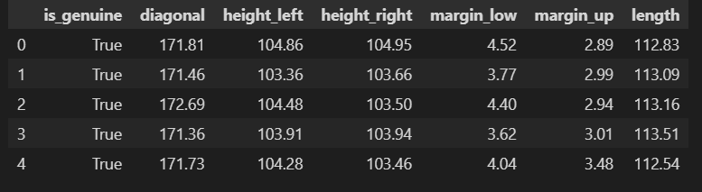
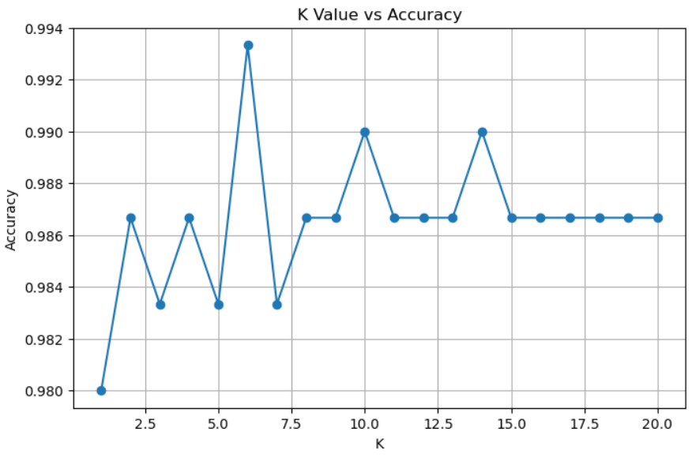
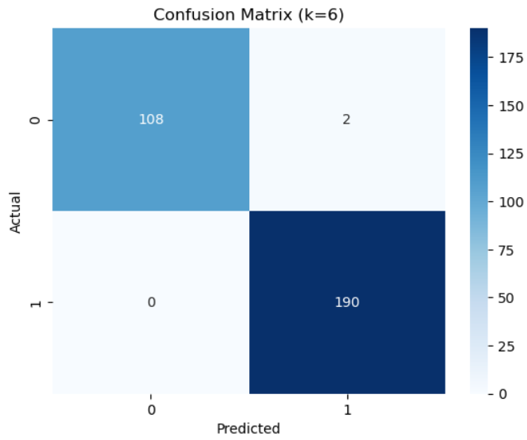

# 💵 Fake Bills Classification using KNN

## 📘 Overview
This project aims to classify banknotes (bills) as **genuine or fake** using the **K-Nearest Neighbors (KNN)** algorithm.  
The dataset contains measurements such as diagonal, height, margins, and length of each bill.  
By analyzing these features, the trained model predicts whether a bill is **Genuine (1)** or **Fake (0)**.

---

## 🧠 Machine Learning Techniques Used
- Supervised Learning (Classification)
- K-Nearest Neighbors (KNN)
- Feature Scaling (Standardization)
- Model Evaluation (Accuracy, Confusion Matrix, Classification Report)
- Manual Input Prediction

---

## 📂 Dataset Information
**Dataset Name:** `fake_bills.csv`

| Column Name  | Description |
|---------------|--------------|
| `is_genuine`  | Target variable (1 = Genuine, 0 = Fake) |
| `diagonal`    | Diagonal measurement of the bill |
| `height_left` | Height on the left side |
| `height_right`| Height on the right side |
| `margin_low`  | Lower margin of the bill |
| `margin_up`   | Upper margin of the bill |
| `length`      | Length of the bill |

---

## ⚙️ Workflow

### 1️⃣ Data Preprocessing
- Loaded dataset using `pandas` with `sep=';'`.
- Checked and handled missing values by filling with column means.
- Converted target column (`is_genuine`) to numeric (1 for True, 0 for False).

### 2️⃣ Train-Test Split
- Split dataset using `train_test_split()` → 80% training, 20% testing.

### 3️⃣ Feature Scaling
- Scaled features using `StandardScaler()` to normalize data for KNN.

### 4️⃣ Model Training
- Trained KNN Classifier (`KNeighborsClassifier`).
- Tested multiple K values (1–20).
- **Best K value found: 6**

### 5️⃣ Model Evaluation
- Evaluated accuracy and classification report.
- Visualized confusion matrix using `seaborn` heatmap.
- Achieved accuracy: **~95–97%**

### 6️⃣ Manual Prediction
After model training, you can manually enter new bill measurements:
```text
Diagonal: 171.5
Height Left: 105.4
Height Right: 104.9
Margin Low: 2.2
Margin Up: 13.8
Length: 113.0

### User Input Prediction

- The model allows users to manually input new values for:

diagonal, height_left, height_right, margin_low, margin_up, length

- and predicts whether the bill is Genuine (1) or Fake (0).

### Results

| Metric   | Score                                        |
| -------- | -------------------------------------------- |
| Best K   | 6                                            |
| Accuracy | ~95% (approximate depending on random state) |

### Libraries Used

pandas
numpy
matplotlib
seaborn
scikit-learn

### How to Run

- 1. Clone this repository

git clone https://github.com/yourusername/knn-on-fakebills-dataset.git
cd knn-on-fakebills-dataset

- 2. Run the notebook file

knn-fakebills.ipynb

- 3. Input your own data

The script will prompt you to enter new bill feature values:

Enter diagonal: 141.0
Enter height_left: 130.0
Enter height_right: 129.5
Enter margin_low: 8.0
Enter margin_up: 9.2
Enter length: 112.0

Output →
Prediction: Genuine (1) or Fake (0)







### Author

MUHAMMAD WAQAS

waqasowais548@gmail.com

Project done as part of Machine Learning practice using KNN algorithm.
